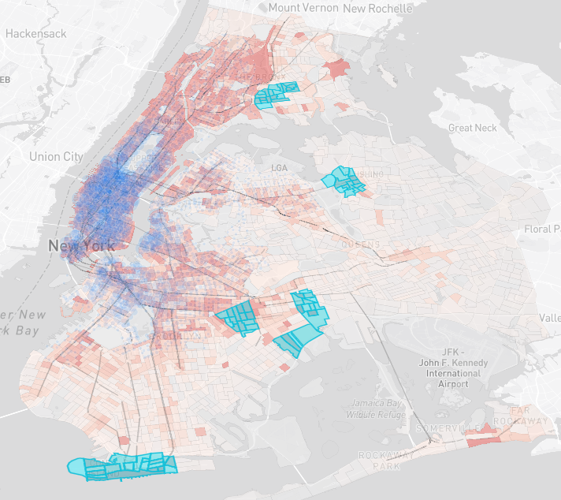

# The City Where Bike Share Isn't Shared
### DSC 106 Final Project @ UCSD

**An interactive data story revealing NYC's "transit deserts" by visualizing dense, car-free neighborhoods served by neither the subway nor the Citi Bike network.**

🔗 **[View Live Demo](https://musubi3.github.io/nyc-bike-share-access)**

---

## 📖 The Story
New York City has one of the largest bike-share systems in the world, but coverage is not evenly distributed. This project uses scrollytelling and spatial analysis to argue for the next phase of expansion.

The narrative is told in three parts:

1.  **The Pulse:**  Visualizing the massive scale of the current network (Jan 2025).

2.  **The Hidden Layer:**  Overlaying vehicle ownership data (ACS 2021) to reveal car-free neighborhoods in the outer boroughs that lack bike access.

3.  **The Next Frontier:**  Identifying 5 specific "Transit Deserts" (like Flushing and Brownsville), communities with high density, limited subway access, and no bike stations, that should be prioritized next.

---

## 🤖 Methodology: Site Suitability Analysis
To move beyond simple visual inspection, we developed a **Python-based optimization algorithm** to score every census tract in NYC for expansion priority.

The algorithm calculates an **"Expansion Score" (0-100)** based on three weighted factors:

1.  **Transit Need (45%):** Prioritizes neighborhoods with high car-free household rates (ACS Data).  
2.  **Population Density (40%):** Ensures new stations serve the maximum number of residents.  
3.  **Network Gap (15%):** Favors areas that are geographically isolated from the current station network.  

> **The Formula:** 
> $Score = (0.40 \times Density) + (0.45 \times Need) + (0.15 \times Gap)$

*See the full analysis script in [`notebooks/analysis.ipynb`](notebooks/analysis.ipynb).*

---

## 🗝️ Key Findings
Our spatial analysis identified five specific neighborhoods, including <strong>Spring Creek-Starrett City</strong> and <strong>Parkchester & Soundview-Bruckner-Bronx River</strong>, that are high-density, heavily car-free (>60%), and completely unserved by bike share.

Targeting these areas for the next expansion phase would connect over <strong>172,000 households</strong> to the transit network.

---

## 🛠 Tech Stack
* **Frontend:** Mapbox GL JS, D3.js, Vanilla ES6 JavaScript, HTML5/CSS3 (Glassmorphism UI).  
* **Analysis:** Python (Pandas, GeoPandas, Scikit-Learn, NetworkX).

---

## 📊 Data Sources
We utilized three primary datasets to build this analysis:

| Dataset | Source | Description |
| :--- | :--- | :--- |
| **Citi Bike Trip Data** | [Citi Bike System Data](https://citibikenyc.com/system-data) | Random sample of 100,000 trips from **January 2025**. Used to generate station density and usage metrics. |
| **Vehicle Availability** | [Census Reporter (ACS 2023)](https://censusreporter.org/) | "Household Size by Vehicles Available" (Table B08201) at the Census Tract level. Used to calculate Car-Free %. |
| **Subway Routes** | [NYU Spatial Data Repository](https://geo.nyu.edu/catalog/nyu-2451-60067) | Geospatial lines for all active NYC subway routes (2019). Used to visually prove transit gaps. |
| **Neighborhood Tabulation Areas** | [NYC Open Data](https://data.cityofnewyork.us/City-Government/2020-Census-Tracts/63ge-mke6/about_data) | GeoJSON boundaries for aggregating census tracts into recognizable neighborhoods. |